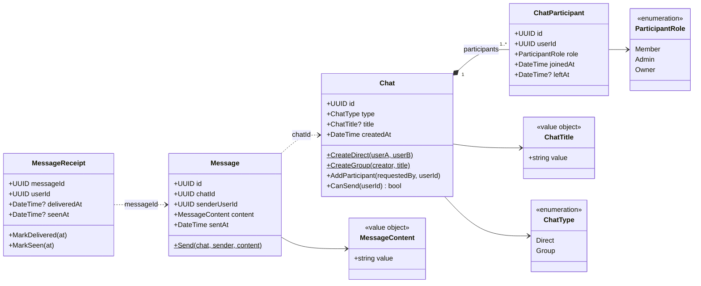

## Invarianter
- **Direct:** præcis 2 forskellige brugere, begge `Member`, ingen titel, ingen nye deltagere.
- **Group:** har en titel. Opretteren bliver `Owner`. Kun `Owner`/`Admin` kan tilføje deltagere. En bruger kan kun være deltager én gang.
- **Send:** kun aktive deltagere (`leftAt` er tom) kan sende.
- **Receipt:** `deliveredAt` og `seenAt` sættes første gang og overskrives aldrig.
- **ChatTitle:** trimmet, 1-200 tegn. **MessageContent:** ikke tom, maks. 4000 tegn.
