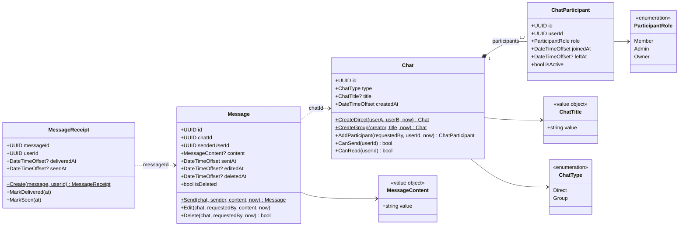

`now`/`at` gives udefra (fra `TimeProvider`), så domænet ikke selv læser uret. `Restore(...)` på hver entitet bruges kun ved genopbygning fra databasen og er udeladt af diagrammet.

## Invarianter
- **Direct:** præcis 2 forskellige brugere, begge `Member`, ingen titel, ingen nye deltagere.
- **Group:** har en titel. Opretteren bliver `Owner`. Kun `Owner`/`Admin` kan tilføje deltagere. En bruger kan kun være deltager én gang.
- **Send:** kun aktive deltagere (`leftAt` er tom) kan sende.
- **Læs:** kun aktive deltagere kan læse chatten, dens beskeder og receipts (`CanRead`, i dag samme regel som `CanSend`).
- **Edit/Delete:** kun afsenderen, og kun mens de er aktiv deltager. En slettet besked kan ikke redigeres. Sletning er blød: `content` fjernes, og `deletedAt` sættes én gang (gentagen sletning er en no-op).
- **Receipt:** ingen receipt for afsenderen selv. `deliveredAt` og `seenAt` sættes første gang og overskrives aldrig.
- **ChatTitle:** trimmet, 1-200 tegn. **MessageContent:** ikke tom, maks. 4000 tegn.
