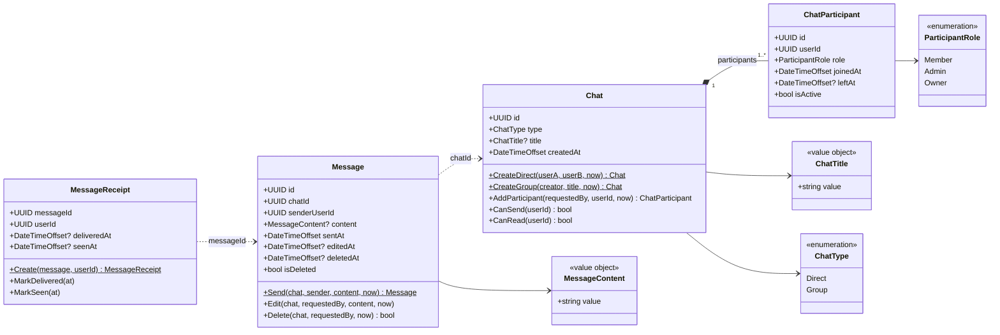

`now`/`at` are passed in from outside (from `TimeProvider`), so the domain never reads the clock itself. `Restore(...)` on each entity is only used when rehydrating from the database and is left out of the diagram.

## Invariants
- **Direct:** exactly 2 distinct users, both `Member`, no title, no new participants.
- **Group:** has a title. The creator becomes `Owner`. Only `Owner`/`Admin` can add participants. A user can only be a participant once.
- **Send:** only active participants (`leftAt` is empty) can send.
- **Read:** only active participants can read the chat, its messages and receipts (`CanRead`, currently the same rule as `CanSend`).
- **Edit/Delete:** only the sender, and only while they are an active participant. A deleted message cannot be edited. Deletion is soft: `content` is removed and `deletedAt` is set once (deleting again is a no-op).
- **Receipt:** no receipt for the sender themselves. `deliveredAt` and `seenAt` are set the first time and never overwritten.
- **ChatTitle:** trimmed, 1-200 characters. **MessageContent:** not empty, max 4000 characters.
