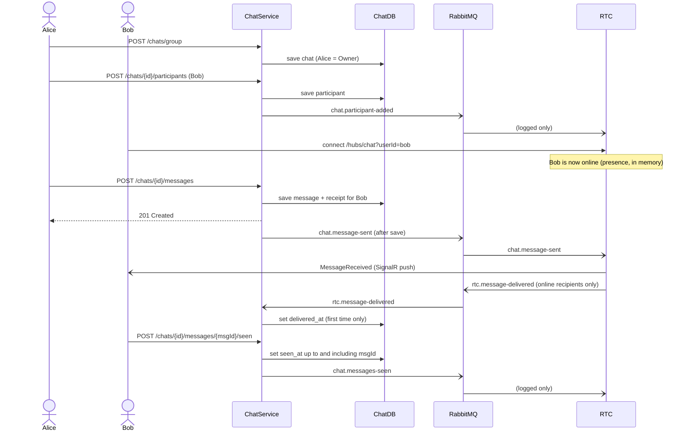

# Bizcord – Analysis & Design (ChatService and RTC)

## 1. Overview

Bizcord is a Discord-like chat platform split into bounded contexts (map below). This repository implements two of them:

- **ChatService** (Chat context) – direct and group chats, messages and read receipts.
- **Real-Time Communication (RTC)** – pushes new messages to users who are online.

The other contexts (User, UserAuth, Channel, Engagement) are not implemented here; we only reference users by `userId`. "NotificationHub" on the map is RabbitMQ in the implementation. "Chat Context" on the map is ChatService in the code and the C4 model, in the folder `apps/chat-microservice`.

C4 model (containers, and components for ChatService and RTC): [`workspace.dsl`](../C4%20diagram/docs/workspace.dsl)


## 2. Services and boundaries

| Service | Responsible for | NOT responsible for | Code |
| --- | --- | --- | --- |
| ChatService | Direct and group chats: participants, messages and receipts (delivered/seen). Source of truth via REST. | Channel messages (Channel Service), users and authentication, pushing to clients | [`apps/chat-microservice`](../apps/chat-microservice) |
| RTC | Pushing new messages to online users (SignalR), tracking who is online, reporting what was delivered | Storing anything, receiving messages from clients (the hub is server → client only), deciding who may read a chat | [`apps/real-time-communication-microservice`](../apps/real-time-communication-microservice) |

**Why the boundaries are here:**
- **ChatService ↔ RTC:** Storage and live delivery fail and scale differently. If RTC is down, nothing is lost – the message is saved, and clients fetch it via REST.
- **Who may receive a message:** ChatService decides. `chat.message-sent` carries `recipientUserIds` (active participants minus the sender), and RTC pushes only to those who are online among them. RTC never calls ChatService and has no access rules of its own.
- **Chat ↔ Channel:** Channels have their own server and role permissions. Keeping channel messages out of ChatService keeps those rules in the Channel context.
- **Chat ↔ User:** Users are referenced by `userId` only. Identity is trusted from a header (MVP – see section 5).

**Two kinds of chat:**
- **Direct:** exactly two users, both `Member`, no title and no new participants. Creating one is idempotent – asking for the same pair again returns the existing chat.
- **Group:** has a title. The creator becomes `Owner`, and only `Owner`/`Admin` can add participants.

Domain rules (who may send, add participants, etc.): [chatservice-domain.md](../apps/chat-microservice/docs/chatservice-domain.md)

## 3. Data ownership

| Data | Owner | Stored in |
| --- | --- | --- |
| Chat, ChatParticipant, Message, MessageReceipt | ChatService | ChatDB (Postgres) |
| Presence | RTC | In memory (lost on restart) |
| User profile | User Service | UserDB |
| Channel messages | Channel Service | ChannelDB |

No shared databases. Other services reference our data by id via REST or events. Event payloads are copies: RTC forwards message content but never stores it.

## 4. How it fits together

The whole lifecycle of a group chat – REST for commands and queries, RabbitMQ for events, SignalR for push:



If Bob is offline, there is no push and no `delivered_at`. He fetches the message later via `GET /chats/{id}/messages`.

| Event | Producer | Consumer | Used for |
| --- | --- | --- | --- |
| `chat.message-sent` | ChatService | RTC | Push the message to online recipients |
| `chat.participant-added` | ChatService | RTC | Logged only (for now) |
| `chat.messages-seen` | ChatService | RTC | Logged only (for now) |
| `chat.message-edited` | ChatService | – | No consumer yet |
| `chat.message-deleted` | ChatService | – | No consumer yet |
| `rtc.message-delivered` | RTC | ChatService | Set `delivered_at` on receipts |

**Contracts:** Events use logical names, never C# type names, and the services share no code. Each consumer has its own record with only the fields it reads and ignores the rest (tolerant reader). Contract tests on both sides catch breaking changes.

**Shared model:** The shared model is the contract document itself (JSON shapes and event names), not a shared C# project or NuGet package. A shared assembly would tie every service to the same language, .NET version and release cycle. It exposes only what other services need and hides internals such as participant ids and table structure. See [ChatService contracts](../apps/chat-microservice/docs/contracts.md).

**Guarantees:** At-most-once delivery, and events are published only after the change is saved. REST is the source of truth – a lost event costs a push or a `delivered_at`, never a message.

Full contracts: [ChatService](../apps/chat-microservice/docs/contracts.md) · [RTC](../apps/real-time-communication-microservice/docs/contracts.md)

## 5. Decisions and known limitations

| Decision / limitation | Why | Consequence |
| --- | --- | --- |
| RTC is a separate service, not SignalR inside ChatService | Failure isolation – storage and live push fail and scale differently | Extra broker hop; `delivered_at` is set shortly after the message is saved (eventual consistency) |
| At-most-once delivery, events published after save | Simple, no outbox; REST is the source of truth | A lost event costs a push or a `delivered_at`, never a message |
| Fat events: `chat.message-sent` carries content and `recipientUserIds` | RTC can push without calling back to ChatService | Recipients are a snapshot – someone who leaves right after the send still gets the push |
| No shared code between services; tolerant-reader records | Services can deploy independently; unknown fields are ignored | A misspelled event name is not caught by the other side's tests – only by the contract docs and manual e2e |
| Identity trusted from `X-User-Id` / `?userId=` | Authentication is out of scope for the MVP | Anyone can impersonate a user; to be replaced by a validated token |
| "Delivered" means pushed to a connection, not acknowledged by the client | No client ack yet | A connection that dies at the same moment can produce a false "delivered" |
| Presence is in memory | Simplest possible | Lost on restart, and RTC can't run more than one instance without a SignalR backplane |
| `chat.participant-added` and `chat.messages-seen` are only logged by RTC | Published now so future consumers (e.g. live "seen" updates) need no change in ChatService | Events without a real consumer yet |
| No leave chat or rename group yet (edit and delete message are implemented) | MVP focused on the send/deliver/seen flow | `left_at` exists in the domain but can't be set via the API |
| Postgres + Dapper with hand-written SQL migrations, not EF Core | Queries and migrations are plain SQL under version control, and we practise what we learned in Databases for Developers: hand-written SQL and a migration strategy | More SQL and mapping code to maintain than with EF Core |

> **TODO – decide at the group meeting on Thursday (delete this box when done):**
> 1. **participant-added / messages-seen row:** Is the "Why" our actual reason? If there was no plan, write it honestly (e.g. "published for future use").
> 2. **Context map – Chat Service:** It says "Handles Personal- and channel-based chat", which contradicts section 2 (channel messages belong to Channel Service). Change it to e.g. "Handles direct and group chats" in Canva.
> 3. **Context map – `rtc.message-delivered`:** Realtime Communication only has "Subscribes to events". Add an arrow showing that RTC also publishes to NotificationHub ("Publish: message delivered").

## 6. Getting started

**Run** (only Docker is required):

```bash
docker compose up -d --build   # from the repo root
dotnet test Bizcord.slnx       # Postgres and RabbitMQ are started by Testcontainers
```

| What | Where |
| --- | --- |
| ChatService API (Swagger) | http://localhost:8000/swagger |
| RTC (SignalR hub) | http://localhost:8080/hubs/chat?userId={uuid} |
| RabbitMQ management | http://localhost:15672 (guest/guest) |
| Manual requests | [`ChatService.http`](../apps/chat-microservice/src/ChatService/ChatService.http) |

Don't run the compose files under `apps/` at the same time – they use the same ports.

**Where to start reading** – follow one message through the system:

1. [`MessagesController.cs`](../apps/chat-microservice/src/ChatService/Controllers/MessagesController.cs) – REST entry point
2. [`MessageAppService.cs`](../apps/chat-microservice/src/ChatService/Application/MessageAppService.cs) – saves the message, then publishes `chat.message-sent`
3. [`Chat.cs`](../apps/chat-microservice/src/ChatService/Domain/Chat.cs) – the domain rules (who may send, add participants)
4. [`MessageSentHandler.cs`](../apps/real-time-communication-microservice/src/RealTimeCommunicationServer/Messaging/Handlers/MessageSentHandler.cs) – RTC pushes to online recipients and publishes `rtc.message-delivered`
5. [`MessageDeliveredConsumer.cs`](../apps/chat-microservice/src/ChatService/Infrastructure/Messaging/MessageDeliveredConsumer.cs) – ChatService sets `delivered_at`
